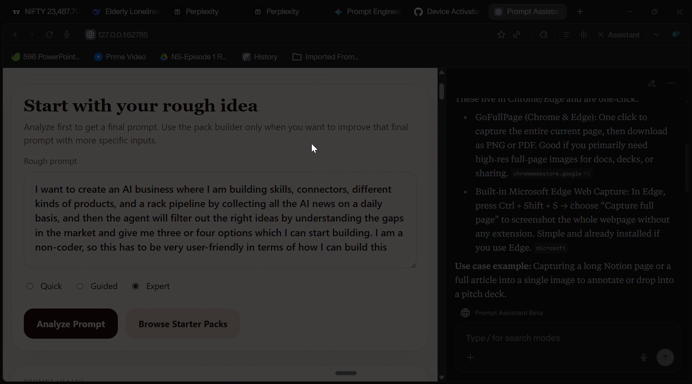

# PROMPTER

PROMPTER is a local-first browser app that helps turn rough prompts into clearer, stronger prompts without making users learn prompt engineering from scratch.

It focuses on two practical jobs:

1. refine a rough prompt into a stronger final prompt
2. help users start faster with a curated prompt library



## Why it exists

Most people do not need a giant prompt theory course. They need help getting from:

- "here is my messy idea"

to:

- "here is a prompt I can actually use right now"

PROMPTER is designed to make that jump faster by improving structure, reducing ambiguity, and surfacing stronger prompt starting points.

## What it does today

- local browser-first interface
- rough prompt cleanup and refinement
- final prompt output plus alternate prompt versions
- guided prompt building for more structured use cases
- prompt packs and library browsing
- token-efficiency comparison hints
- local prompt history

## Core flow

1. paste a rough prompt or idea
2. choose a mode such as quick, guided, or expert
3. refine the prompt into a clearer final version
4. optionally browse starter packs and adapt a ready-made prompt

## Example use cases

- founders shaping MVP ideas
- marketers tightening copy prompts
- students improving study prompts
- creators building content prompts
- developers clarifying debugging or build prompts

## What makes it different

- local-first by default
- browser-based instead of chat-only
- built around practical prompt repair, not abstract theory
- includes starter packs for common real-world workflows
- tries to reduce wasted retries and token spend

## Quick start

### Windows launcher

From the project folder, double-click:

`PROMPTER.bat`

You can also use:

`start_prompt_assistant.bat`

Keep the launcher window open while the app is running.

### Command line

From the project folder:

```bash
prompt_assistant web
```

The app writes its active local URL to:

`.\.prompt_assistant\current_url.txt`

## Install for development

PROMPTER expects the local virtual environment already used by this repo.

Key project commands are exposed through `pyproject.toml`, including:

- `prompt_assistant`
- `prompter`
- `prompt_assistant_beta`
- `prompter_beta`

## Windows beta packaging

To build a portable Windows beta:

```powershell
powershell -ExecutionPolicy Bypass -File .\release\build_windows_exe.ps1
```

The newest packaged build will appear in:

`release-build\`

## Project layout

```text
src/project_360_degree_ai_prompt_assistant_platform/
  assistant.py
  main.py
  optimizer.py
  prompt_library.py
  web_ui.py
  settings.py

release/
  build_windows_exe.ps1
  PromptAssistantBeta.spec

tests/
docs/
```

## Current product status

PROMPTER is currently a browser MVP with a local-first workflow.

- the product-facing name is `PROMPTER`
- the main experience is the browser app
- the older CrewAI scaffold still exists in the codebase
- a hosted public demo is not the primary path yet

## Good first feedback

If you try it, the most useful feedback is:

- was the refined prompt clearly better than the original
- did the starter pack flow make sense
- which user type this feels most useful for
- where the flow feels confusing or too manual

## Notes

This repo is being shaped into a cleaner public product surface. Internal package names still reflect the earlier project scaffold in some places, but the product name and launch direction are now centered on `PROMPTER`.
